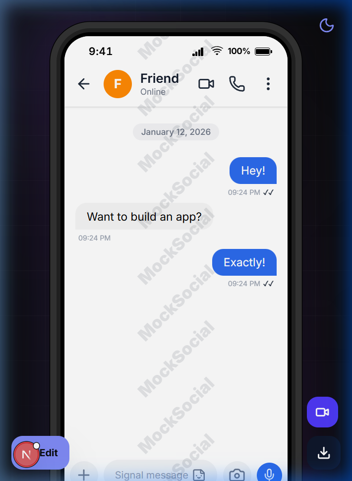
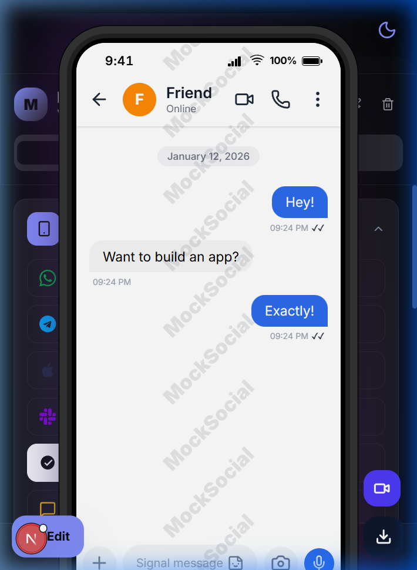
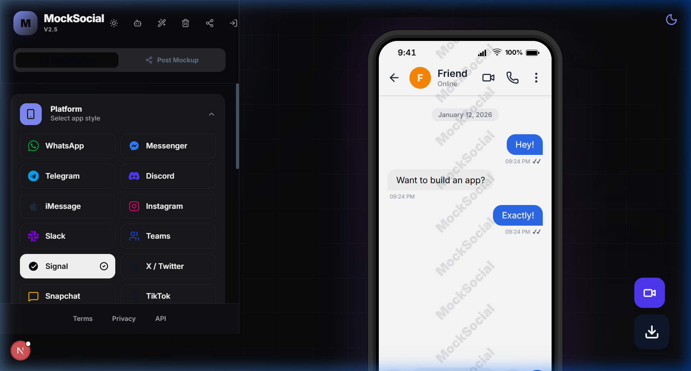
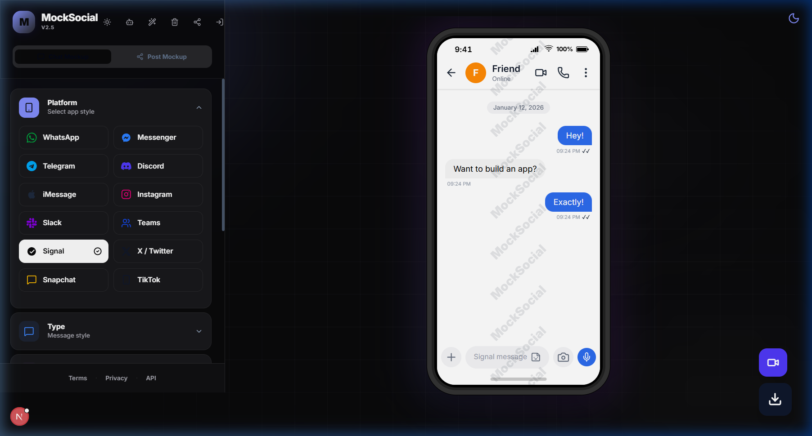

# MockSocial Architecture

> Detailed technical documentation of the MockSocial project architecture.

---

## Table of Contents

1. [Overview](#overview)
2. [Tech Stack](#tech-stack)
3. [High-Level Architecture](#high-level-architecture)
4. [Core Components](#core-components)
5. [State Management](#state-management)
6. [Data Flow](#data-flow)
7. [Skin System](#skin-system)
8. [URL-Based State Sharing](#url-based-state-sharing)
9. [Smart Autofill System](#smart-autofill-system)
10. [Mobile Responsiveness](#mobile-responsiveness)
11. [Project Structure](#project-structure)

---

## Overview

MockSocial is a web application that generates high-fidelity social media chat mockups. Users can create realistic simulations of various messaging platforms (WhatsApp, Signal, iMessage, etc.) directly in the browser, export them as images, and share configurations via URL.

### Key Capabilities

- **Multi-platform skins**: Support for 15+ messaging platforms
- **Two mockup types**: Chat conversations and social media posts
- **Real-time editing**: Live visual editing with instant preview including advanced contexts like replies and reactions
- **No database required**: State fully encoded in URL for sharing
- **Smart content generation**: Random content via faker.js + AI-powered contextual conversations via Gemini
- **Animated Exports**: Generate native rolling `.gif` videos simulating realistic chat scrolling directly on the client
- **Saved Mockups**: Persistent named snapshots of any mockup configuration with one-click restore, stored in `localStorage` via Zustand persist
- **Fully Mobile Responsive**: Bottom-sheet sidebar, dynamic viewport-aware mockup scaling, and touch-optimised controls across all device sizes

---

## Tech Stack

| Technology | Purpose | Version |
|------------|---------|---------|
| **Next.js 16** | Framework & routing | ^16.1.1 |
| **React 19** | UI library | ^19.2.3 |
| **TypeScript** | Type safety | ^5.9.3 |
| **Tailwind CSS v4** | Styling | ^4.1.18 |
| **Zustand** | State management | ^5.0.10 |
| **Framer Motion** | Animations | ^12.26.1 |
| **LZ-String** | URL compression | ^1.5.0 |
| **html-to-image** | Screenshot export | ^1.11.13 |
| **modern-gif** | Animated GIF export | ^2.0.4 |
| **@dnd-kit** | Drag-and-drop | ^6.3.1 / ^10.0.0 |
| **lucide-react** | Icons | ^0.562.0 |
| **@faker-js/faker** | Random data | ^10.2.0 |
| **@google/generative-ai** | AI conversation generation | ^0.24.1 |
| **emoji-picker-react** | Emoji input (lazy-loaded) | ^4.17.3 |
| **@vercel/analytics** | Page-view analytics | ^2.0.1 |
| **@vercel/speed-insights** | Web vitals monitoring | ^2.0.0 |
| **Vitest** | Unit testing | ^4.0.18 |

---

## High-Level Architecture

```
┌─────────────────────────────────────────────────────────────────┐
│                         Application Layer                        │
├─────────────────────────────────────────────────────────────────┤
│  ┌─────────────────────┐     ┌────────────────────────────────┐ │
│  │     Sidebar         │────▶│     Zustand Store              │ │
│  │  (User Controls)    │     │  ┌──────────┐ ┌──────────────┐ │ │
│  │                     │     │  │App Slice │ │ Chat Slice   │ │ │
│  │  - Platform Select  │     │  │          │ │              │ │ │
│  │  - Message Editor   │     │  │- platform│ │- messages    │ │ │
│  │  - Contact Config   │     │  │- theme   │ │- contact     │ │ │
│  │  - Appearance       │     │  │- mockup  │ │- postConfig  │ │ │
│  └─────────────────────┘     │  └──────────┘ └──────────────┘ │ │
│          │                    └────────────────────────────────┘ │
│          │                              │                        │
│          ▼                              ▼                        │
│  ┌─────────────────────────────────────────────────────────────┐│
│  │                     ChatCanvas                               ││
│  │  ┌──────────────────────────────────────────────────────┐   ││
│  │  │              Phone Frame Container                    │   ││
│  │  │  ┌────────────────────────────────────────────────┐   │   ││
│  │  │  │              Status Bar                        │   │   ││
│  │  │  └────────────────────────────────────────────────┘   │   ││
│  │  │  ┌────────────────────────────────────────────────┐   │   ││
│  │  │  │         Dynamic Skin Renderer                  │   │   ││
│  │  │  │  ┌─────────────────────────────────────────┐   │   │   ││
│  │  │  │  │  SignalSkin / WhatsAppSkin / ...       │   │   │   ││
│  │  │  │  │  (Platform-specific UI components)     │   │   │   ││
│  │  │  │  └─────────────────────────────────────────┘   │   │   ││
│  │  │  └────────────────────────────────────────────────┘   │   ││
│  │  └──────────────────────────────────────────────────────┘   ││
│  └─────────────────────────────────────────────────────────────┘│
└─────────────────────────────────────────────────────────────────┘
```

### Data Flow

1. **User Input**: User modifies settings in Sidebar (e.g., changes message, selects platform)
2. **State Update**: Sidebar calls Zustand store actions to update state
3. **Re-render**: React re-renders affected components with new state
4. **Skin Update**: ChatCanvas detects platform change, renders appropriate skin component
5. **Export/Share**: User can export as PNG or generate shareable URL

---

## Core Components

### 1. ChatCanvas (`src/components/canvas/ChatCanvas.tsx`)

The main rendering component that displays the phone frame and selects the appropriate skin.

**Responsibilities:**
- Phone frame rendering with realistic design (notch, buttons, shadows)
- Platform-specific skin selection
- Screenshot export functionality
- Watermark and keyboard overlay management

**Key Props:**
```typescript
// Uses Zustand store internally
const { platform, isDarkMode, mockupType, wallpaper, showKeyboard } = useChatStore();
```

### 2. Sidebar (`src/components/sidebar/Sidebar.tsx`)

The control panel for all mockup configurations.

**Sections:**
- **Platform Selector**: Grid of available messaging apps
- **Mockup Type Tabs**: Chat vs Post mockup
- **Message Editor**: Add/edit/delete/reorder messages
- **Contact/Author**: Name, avatar, status configuration
- **Appearance**: Theme, wallpaper, status bar settings
- **Actions**: Generate random content, reset, share, export

### 3. Skin Components (`src/components/skins/*.tsx`)

Platform-specific UI implementations following a consistent interface.

**Skin Interface:**
```typescript
// Each skin receives data from Zustand store
const { contact, messages, isDarkMode, wallpaper, statusBar, postConfig } = useChatStore();
```

**Available Skins:**
| Type | Skins |
|------|-------|
| Chat | Signal, WhatsApp, iMessage, Messenger, Telegram, Discord, Instagram, Slack, Teams, X, Snapchat, TikTok |
| Post | Instagram Post, X Post, LinkedIn Post, Threads Post |

---

## State Management

### Zustand Store Architecture

The store uses a **sliced pattern** to separate concerns and keep code maintainable.

```
useChatStore (Combined Store)
    ├── createAppSlice          → Global app settings
    ├── createChatSlice         → Chat-specific data
    ├── createPostSlice         → Post-specific data
    ├── createSavedMockupsSlice → Named mockup snapshots (save/load/delete)
    ├── exportQuality           → Top-level PNG pixel-ratio (1 | 2 | 3)
    └── Middleware              → Persistence + Actions
```

### Slices Overview

#### 1. App Slice (`src/store/slices/createAppSlice.ts`)

```typescript
interface AppSlice {
  mockupType: 'chat' | 'post';
  platform: Platform;
  statusBar: StatusBarConfig;
  isDarkMode: boolean;
  showWatermark: boolean;
  wallpaper: string | null;
  showKeyboard: boolean;
  isMobileSheetOpen: boolean; // Controls the mobile bottom-sheet sidebar

  // Actions
  setMockupType: (type: MockupType) => void;
  setPlatform: (platform: Platform) => void;
  updateStatusBar: (updates: Partial<StatusBarConfig>) => void;
  toggleDarkMode: (isDark: boolean) => void;
  toggleWatermark: (show: boolean) => void;
  setWallpaper: (url: string | null) => void;
  toggleKeyboard: (show: boolean) => void;
  setMobileSheetOpen: (open: boolean) => void;
}
```

#### 2. Chat Slice (`src/store/slices/createChatSlice.ts`)

```typescript
interface ChatSlice {
  contact: Contact;
  messages: Message[];

  // Actions
  updateContact: (updates: Partial<Contact>) => void;
  addMessage: (message: Omit<Message, 'id'>) => void;
  setMessages: (messages: Message[]) => void;
  updateMessage: (id: string, updates: Partial<Message>) => void;
  deleteMessage: (id: string) => void;
  reorderMessages: (fromIndex: number, toIndex: number) => void;
}
```

#### 3. Post Slice (`src/store/slices/createPostSlice.ts`)

```typescript
interface PostSlice {
  postConfig: PostConfig;

  // Actions
  updatePostConfig: (updates: Partial<PostConfig>) => void;
}
```

#### 4. Saved Mockups Slice (`src/store/slices/createSavedMockupsSlice.ts`)

```typescript
interface SavedMockup {
  id: string;
  name: string;
  createdAt: number; // unix ms timestamp
  platform: Platform;
  mockupType: MockupType;
  contact: Contact;
  messages: Message[];
  statusBar: StatusBarConfig;
  postConfig: PostConfig;
  isDarkMode: boolean;
  wallpaper: string | null;
  phoneStyle: PhoneStyle; // 'default' | 'mini' | 'pro'
}

interface SavedMockupsSlice {
  savedMockups: SavedMockup[];

  // Actions
  saveMockup: (name: string) => void;  // Snapshot current state
  loadMockup: (id: string) => void;    // Restore a saved snapshot
  deleteMockup: (id: string) => void;
}
```

Saves are **prepended** (newest first) and **fully persisted** to `localStorage` alongside all other state.

### Persistence

The store uses Zustand's `persist` middleware to save to localStorage:

```typescript
export const useChatStore = create<ChatState>()(
  persist(
    (...a) => {
      // Combine all slices
      return {
        ...createAppSlice(...a),
        ...createChatSlice(...a),
        ...createPostSlice(...a),
        ...createSavedMockupsSlice(...a),
        exportQuality: 2,
        setExportQuality: (quality) => set({ exportQuality: quality }),
        generateRandomContent: () => { /* ... */ },
        resetState: () => { /* ... */ },
        importState: (state: Partial<ChatState>) => { /* ... */ },
      };
    },
    {
      name: 'chat-mockup-storage',
      version: 2, // Bumped when savedMockups was added
      migrate: (persistedState, version) => {
        if (version === 0) persistedState.phoneStyle = 'default';
        if (version < 2) persistedState.savedMockups = [];
        return persistedState;
      },
      partialize: (state) => ({
        // Only persist essential data
        mockupType: state.mockupType,
        platform: state.platform,
        contact: state.contact,
        messages: state.messages,
        statusBar: state.statusBar,
        postConfig: state.postConfig,
        isDarkMode: state.isDarkMode,
        showWatermark: state.showWatermark,
        phoneStyle: state.phoneStyle,
        exportQuality: state.exportQuality, // ← user's preferred pixel ratio
        savedMockups: state.savedMockups,   // ← persisted history
      }),
    }
  )
);
```

---

## Data Flow

### URL State Encoding (Db-Free Sharing)

The application supports sharing via URL without a database using LZ-String compression.

**Flow:**
```
1. User clicks "Share" button
2. encodeState() extracts shareable data
3. Data compressed via LZString.compressToEncodedURIComponent()
4. Encoded string appended to URL: ?s=<compressed>
5. UrlHydrator component reads on page load
6. State imported via importState() action
```

**Implementation** (`src/lib/url-state.ts`):

```typescript
export const encodeState = (state: ChatState): string => {
  const shareableData: ShareableState = {
    mockupType: state.mockupType,
    platform: state.platform,
    contact: state.contact,
    messages: state.messages,
    statusBar: state.statusBar,
    postConfig: state.postConfig,
    isDarkMode: state.isDarkMode,
  };
  const json = JSON.stringify(shareableData);
  return LZString.compressToEncodedURIComponent(json);
};

export const decodeState = (encoded: string): Partial<ChatState> | null => {
  try {
    const json = LZString.decompressFromEncodedURIComponent(encoded);
    if (!json) return null;
    return JSON.parse(json);
  } catch (e) {
    console.error('Failed to decode state', e);
    return null;
  }
};
```

---

## Mobile Responsiveness

MockSocial is fully responsive and works across all device sizes — from narrow phones (360px) to widescreen desktops.

### Layout Strategy

| Breakpoint | Layout |
|---|---|
| `< 1024px` (mobile/tablet) | Canvas-first: phone mockup fills the screen; Sidebar hidden by default as a **bottom sheet** |
| `≥ 1024px` (desktop) | Side-by-side: Sidebar as a fixed left panel (440px), canvas on the right |

### Sidebar Bottom Sheet (`Sidebar.tsx`)

On mobile, the Sidebar renders as a Framer Motion animated drawer:

```tsx
<motion.div
  className="fixed bottom-0 left-0 right-0 z-50 rounded-t-3xl ..."
  animate={{ y: isMobileSheetOpen ? 0 : '100%' }}
  transition={{ type: 'spring', damping: 32, stiffness: 320 }}
  style={{ maxHeight: isMobileSheetOpen ? '90svh' : undefined }}
>
  {/* Drag handle */}
  <div className="lg:hidden w-10 h-1 rounded-full bg-border mx-auto" />
  {/* ... sidebar content ... */}
</motion.div>
```

- A **blurred backdrop** renders behind the sheet; tapping it closes the sheet
- Inner content uses `overscroll-contain` to prevent the page scrolling underneath
- Mobile header is compacted — Share, UserAuth, and Pro buttons are hidden (`hidden lg:contents`) to prevent overflow

### Dynamic Mockup Scaling (`ChatCanvas.tsx`)

A `ResizeObserver` computes the correct scale factor for the phone mockup after every container resize:

```typescript
const compute = () => {
  const available = wrapper.clientWidth - 32; // 16px padding each side
  const scale = Math.min(1, available / getMockupWidth());
  setDynamicScale(scale);
};
compute(); // fires immediately on mount
const obs = new ResizeObserver(compute);
obs.observe(wrapper);
```

- Scale is initialised as `null` on the server to avoid hydration mismatches
- `suppressHydrationWarning` is set on the styled div as a backstop

### Mobile FABs

| Button | Mobile Position | Desktop Position |
|---|---|---|
| GIF export | `bottom-4 right-4` · `44×44px` | `bottom-10 right-10` · `56×56px` |
| PNG download | `bottom-4 right-4` · `48×48px` | `bottom-10 right-10` · `64×64px` |
| **Edit** (opens sheet) | `bottom-4 left-4` · primary blue pill | hidden (`lg:hidden`) |

### Store State (`createAppSlice.ts`)

```typescript
isMobileSheetOpen: boolean;            // default: false
setMobileSheetOpen: (open: boolean) => void;
```

### CSS Additions (`globals.css`)

```css
/* Allow scrolling on mobile */
@media (max-width: 1023px) {
  body { overflow: auto; overflow-x: hidden; }
}

/* Remove tap highlight and 300ms delay */
body { -webkit-tap-highlight-color: transparent; }
button, [role="button"] { touch-action: manipulation; }

/* Blurred backdrop for bottom sheet */
.mobile-sheet-backdrop {
  position: fixed; inset: 0;
  background: rgba(0,0,0,0.5);
  backdrop-filter: blur(4px);
  z-index: 40;
}
```

### Screenshots

| Mobile — Canvas | Mobile — Sheet Open |
|:---:|:---:|
|  |  |

| Desktop — Light | Desktop — Dark |
|:---:|:---:|
|  |  |

---

## Smart Autofill System

The Smart Autofill feature generates realistic random content for mockups.

**Implementation** (`src/lib/autofill-utils.ts`):

```typescript
// Uses @faker-js/faker for realistic data generation

export const generateRandomContact = (): Partial<Contact> => {
  const firstName = faker.person.firstName();
  const lastName = faker.person.lastName();
  return {
    name: `${firstName} ${lastName}`,
    status: faker.helpers.arrayElement(['Online', 'Busy', 'At the gym', ...]),
    avatar: faker.image.avatar(),
  };
};

export const generateRandomMessages = (count: number = 5): Message[] => {
  // Generates realistic chat messages with proper timestamps
};

export const generateRandomPost = (): Partial<PostConfig> => {
  // Generates social media post content with engagement metrics
};
```

**Triggered via store action:**
```typescript
generateRandomContent: () => {
  const state = get();
  if (state.mockupType === 'chat') {
    state.updateContact(generateRandomContact());
    state.setMessages(generateRandomMessages(3 + Math.floor(Math.random() * 5)));
  } else {
    state.updatePostConfig(generateRandomPost());
  }
}
```

---

## Export Quality System

The export pipeline supports three configurable pixel-ratio levels controlled by the `exportQuality` store field.

```typescript
export type ExportQuality = 1 | 2 | 3;
```

| Setting | Pixel Ratio | Use Case |
|---------|------------|----------|
| `1` | 1× native | Small, fast previews |
| `2` | 2× (default) | Balanced sharpness for most use cases |
| `3` | 3× | Maximum resolution for print / high-DPI screens |

The user selects quality via a UI control in the Sidebar; the value is persisted to `localStorage` alongside all other state.

---

## Chat Templates

Handcrafted starter conversations (`src/lib/templates.ts`) let users jump directly into a polished mockup without having to type any messages manually.

```typescript
export interface ChatTemplate {
  id: string;
  title: string;        // e.g. "Couple Fight"
  description: string;  // e.g. "The silent treatment escalates fast"
  emoji: string;
  color: string;        // Tailwind class for card accent
  textColor: string;
  platform: Platform;   // Pre-selects the matching skin
  contact: Partial<Contact>;
  messages: Omit<Message, 'id'>[];
}
```

**Available templates:**

| Template | Platform | Description |
|----------|----------|-------------|
| Couple Fight 💔 | iMessage | The silent treatment escalates fast |
| Bestie Recap 🤣 | WhatsApp | Catching up over absolutely nothing |
| Work Standup 💼 | Slack | Corporate chaos in DMs |
| Making Plans 🗓️ | Telegram | Nobody can commit to anything |
| Late Night 🌙 | Instagram | The 2am totally-friends conversation |
| Post-Party Debrief 🎉 | WhatsApp | The morning after recap |

Selecting a template calls `importState()` to hydrate the store with the template's `contact` and `messages`, then switches to the correct `platform`.

---

## AI Conversation Generator

The AI Conversation Generator uses **Google Gemini 2.0 Flash** to create realistic, contextual chat conversations from natural language scenario prompts.

### Architecture

```
User (Sidebar Bot Button)
    │
    ▼
AIChatDialog Modal
    │  prompt, platform, messageCount
    ▼
POST /api/generate-chat
    │  System prompt + platform tone
    ▼
Google Gemini 2.0 Flash
    │  Structured JSON response
    ▼
Response Parsing & Sanitization
    │
    ▼
Zustand Store Hydration
    │  setMessages() + updateContact()
    ▼
Live Preview Update
```

### Platform Tone System

Each platform has a unique communication style injected into the Gemini system prompt:

| Platform | Tone |
|----------|------|
| WhatsApp | Casual, informal, emoji-heavy, short messages |
| Discord | Very informal, internet slang, meme references |
| Slack | Professional but friendly, workplace style |
| Teams | Professional, polite, structured |
| iMessage | Short texts, emojis, read receipts awareness |
| Instagram | Trendy, emoji-heavy, casual and visual |

### API Route (`src/app/api/generate-chat/route.ts`)

```typescript
// POST handler receives:
interface RequestBody {
  prompt: string;       // User's scenario description
  platform: Platform;   // Current platform for tone matching
  messageCount: number; // 3-15 messages
}

// Returns:
interface ResponseBody {
  messages: Message[];  // Ready to hydrate into store
  contact: Contact;     // Generated contact info
}
```

### Frontend Component (`src/components/shared/ai-chat-dialog.tsx`)

A modal dialog featuring:
- Scenario prompt textarea with Ctrl+Enter shortcut
- 5 clickable example prompts for quick starts
- Message count slider (3–15)
- Platform-aware display showing current target platform
- Loading state with disabled controls during generation

---

## Skin System

### Adding a New Platform

To add a new platform skin:

1. **Define Platform Type** (`src/store/useChatStore.ts`):
   ```typescript
   export type Platform = 'signal' | 'imessage' | 'whatsapp' | /* ... */ | 'new-platform';
   ```

2. **Create Skin Component** (`src/components/skins/NewPlatformSkin.tsx`):
   ```typescript
   export const NewPlatformSkin = () => {
     const { contact, messages, isDarkMode, ... } = useChatStore();
     return (
       <div className="platform-specific-styles">
         {/* UI implementation */}
       </div>
     );
   };
   ```

3. **Register in ChatCanvas** (`src/components/canvas/ChatCanvas.tsx`):
   ```typescript
   switch (platform) {
     case 'new-platform': return <NewPlatformSkin />;
     // ...
   }
   ```

4. **Add to Sidebar** (`src/components/sidebar/Sidebar.tsx`):
   ```typescript
   const platforms: PlatformItem[] = [
     // Add new platform definition
   ];
   ```

### Skin Component Best Practices

- Use Zustand store for all dynamic data
- Support both light and dark modes via `isDarkMode` prop
- Use consistent message bubble structure
- Include metadata (time, read status) for realism
- Handle empty states gracefully

---

## Project Structure

```
mock-social/
├── src/
│   ├── app/                          # Next.js App Router
│   │   ├── api/
│   │   │   ├── generate-chat/        # AI conversation endpoint
│   │   │   │   └── route.ts          # Gemini API integration
│   │   │   └── auth/[...nextauth]/   # NextAuth routes
│   │   ├── globals.css               # Global styles
│   │   ├── layout.tsx                # Root layout
│   │   └── page.tsx                  # Home page
│   │
│   ├── components/
│   │   ├── canvas/                   # Phone frame & rendering
│   │   │   ├── ChatCanvas.tsx        # Main canvas component
│   │   │   ├── StatusBar.tsx         # Dynamic status bar
│   │   │   ├── KeyboardOverlay.tsx   # Keyboard simulation
│   │   │   └── watermark-overlay.tsx # Watermark display
│   │   │
│   │   ├── providers/                # React context providers
│   │   │   ├── auth-provider.tsx     # Session provider
│   │   │   └── theme-provider.tsx    # Theme provider
│   │   │
│   │   ├── shared/                   # Reusable components
│   │   │   ├── ai-chat-dialog.tsx    # AI conversation generator modal
│   │   │   ├── icons.tsx             # SVG icon definitions
│   │   │   ├── share-dialog.tsx      # URL sharing dialog
│   │   │   ├── theme-toggle.tsx      # Theme switcher
│   │   │   ├── url-hydrator.tsx      # URL state hydration
│   │   │   └── user-auth-button.tsx  # Auth button
│   │   │
│   │   ├── sidebar/                  # Configuration controls
│   │   │   ├── Sidebar.tsx           # Main sidebar component
│   │   │   ├── SavedMockupsPanel.tsx # Saved mockup management panel
│   │   │   └── SortableMessage.tsx   # Draggable message item
│   │   │
│   │   ├── skins/                    # Platform-specific skins
│   │   │   ├── SignalSkin.tsx
│   │   │   ├── WhatsAppSkin.tsx
│   │   │   ├── IMessageSkin.tsx
│   │   │   ├── MessengerSkin.tsx
│   │   │   ├── TelegramSkin.tsx
│   │   │   ├── DiscordSkin.tsx
│   │   │   ├── InstagramSkin.tsx
│   │   │   ├── SlackSkin.tsx
│   │   │   ├── TeamsSkin.tsx
│   │   │   ├── XSkin.tsx
│   │   │   ├── SnapchatSkin.tsx
│   │   │   ├── TikTokSkin.tsx
│   │   │   ├── InstagramPostSkin.tsx
│   │   │   ├── XPostSkin.tsx
│   │   │   ├── LinkedInPostSkin.tsx
│   │   │   └── ThreadsPostSkin.tsx
│   │   │
│   │   └── ui/                       # Shadcn/UI primitives
│   │       ├── button.tsx
│   │       ├── input.tsx
│   │       ├── textarea.tsx
│   │       ├── dialog.tsx
│   │       ├── avatar.tsx
│   │       ├── badge.tsx
│   │       ├── tabs.tsx
│   │       ├── accordion.tsx
│   │       ├── separator.tsx
│   │       └── label.tsx
│   │
│   ├── store/                        # Zustand state management
│   │   ├── slices/
│   │   │   ├── createAppSlice.ts          # App settings slice
│   │   │   ├── createChatSlice.ts         # Chat data slice
│   │   │   ├── createPostSlice.ts         # Post data slice
│   │   │   └── createSavedMockupsSlice.ts # Saved mockups history slice
│   │   └── useChatStore.ts           # Combined store
│   │
│   ├── lib/                          # Utilities
│   │   ├── utils.ts                  # General utilities (cn function)
│   │   ├── url-state.ts              # URL encoding/decoding
│   │   ├── autofill-utils.ts         # Random content generation
│   │   ├── export-utils.ts           # GIF construction and native pipelines
│   │   └── templates.ts              # Pre-built chat template scenarios
│   │
│   ├── auth.ts                       # NextAuth configuration
│   └── middleware.ts                 # Next.js middleware
│
├── package.json                      # Dependencies
├── next.config.ts                    # Next.js configuration
├── tailwind.config.ts                # Tailwind configuration
├── tsconfig.json                     # TypeScript configuration
└── README.md                         # Project documentation
```

---

## Key Design Patterns

### 1. Strategy Pattern (Skins)
Each platform uses a dedicated component that can be swapped at runtime based on the selected platform.

### 2. Slice Pattern (State)
Zustand store is split into logical slices (App, Chat, Post, SavedMockups) for maintainability.

### 3. Observer Pattern (Store)
Components subscribe to Zustand store changes and re-render automatically.

### 4. Server-Side Rendering with Client Hydration
Next.js handles initial SSR while client components handle interactivity.

### 5. Memento Pattern (Saved Mockups)
The `SavedMockupsSlice` implements the Memento behavioural pattern: `saveMockup` captures the current store state as an immutable snapshot (memento), and `loadMockup` restores it — without exposing internal state details to the UI layer.

---

## Performance Considerations

1. **Lazy Loading**: Heavy components are dynamically imported to keep the initial bundle lean:
   - All platform skins loaded via `dynamic()` in `ChatCanvas.tsx`
   - `emoji-picker-react` lazy-loaded on first emoji-button click
   - `generateGifFromElements` imported dynamically only when GIF export is triggered
2. **`optimizePackageImports`**: `next.config.ts` enables Next.js compiler-level tree-shaking for `lucide-react` and `framer-motion`, reducing chunk sizes significantly.
3. **Persistence**: State persisted to `localStorage` to preserve work between sessions.
4. **Memoization**: Components use React hooks for efficient re-renders.
5. **Image Compression**: URL sharing warns if data exceeds ~4000 chars.
6. **Vercel Analytics & Speed Insights**: Real-user performance monitoring integrated via `@vercel/analytics` and `@vercel/speed-insights`.

---

## Future Improvements

- More platform skins (WhatsApp Business, Viber, Line)
- Video support in mockups
- Custom theme builder
- Collaboration features
- AI-generated post content (extend Gemini integration to post mockups)
- Cloud sync for Saved Mockups across devices
- PWA / installable app support for mobile